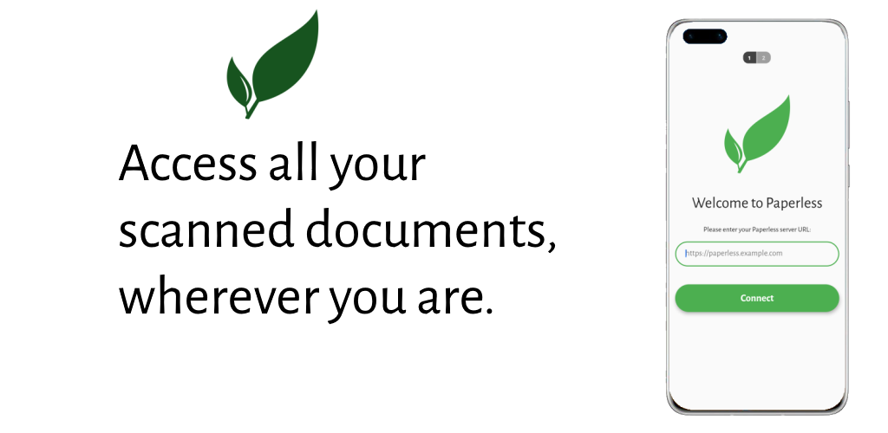

# Paperless App

To use this, you need to have a Paperless server set up. See [Paperless Documentation](https://paperless-ng.readthedocs.io/en/latest/index.html#why-this-exists) for more information.

This open-source app allows you to easily access your documents stored in Paperless from your smartphone. If you need to access an important document on the go, you can find it in seconds.
Paper is a nightmare. Environmental issues aside, there's no excuse for it in the 21st century. It takes up space, collects dust, doesn't support any form of a search feature, indexing is tedious, it's heavy and prone to damage and loss.
Paperless takes documents from your scanner, recognises the text, extracts metadata and gives you the tools you need to manage your documents digitally. It can automatically detect the correspondent and creation date and offers you a search function - all you have to do is scan the documents. Your documents have never been so well organised.
Paperless offers a powerful web interface that is difficult to use on a smartphone. With this app you have a native option to access your documents easily.

It provides the following functionality:

-    Scan documents using smartphone camera with paper detection
-	Securely saves your credentials so you only have to login once
-	Full-text search
-	Customisable order
-	Open PDF documents
-	Dark Mode

Anything missing? Please open an issue.

## Get The App

### Android

### iOS

## How to help?

If you want to help make Paperless App better, there are multiple possibilities:

*Report bugs:* We can only fix issues that we know about. Please check the issue tracker on Github and if it doesn't already exist, report it there.

*Translate the App:* We depend on our community to translate this app. If you know any other language, please visit [Crowdin](https://crowdin.com/project/paperless-app) and help people who don't speak English to use this app!

*Contribute code:* Pull requests are always welcome. If you need any pointers on how to do something just let us know in the chat or in a Github discussion.

## Developing

In order to build the app for local testing, follow these steps:

1. [Install Flutter](https://flutter.dev/docs/get-started/install). This is a Flutter app so you need to set up the Flutter SDK.
2. Run `flutter pub run build_runner build` to build the JSON parser for the Paperless API.
3. Open the app in [whichever editor you prefer](https://flutter.dev/docs/get-started/editor) and start it.

## Releasing new versions
1. Run `flutter pub run release.dart`
2. Upload APKs to Github releases.
3. Upload APKs to Play Store.
